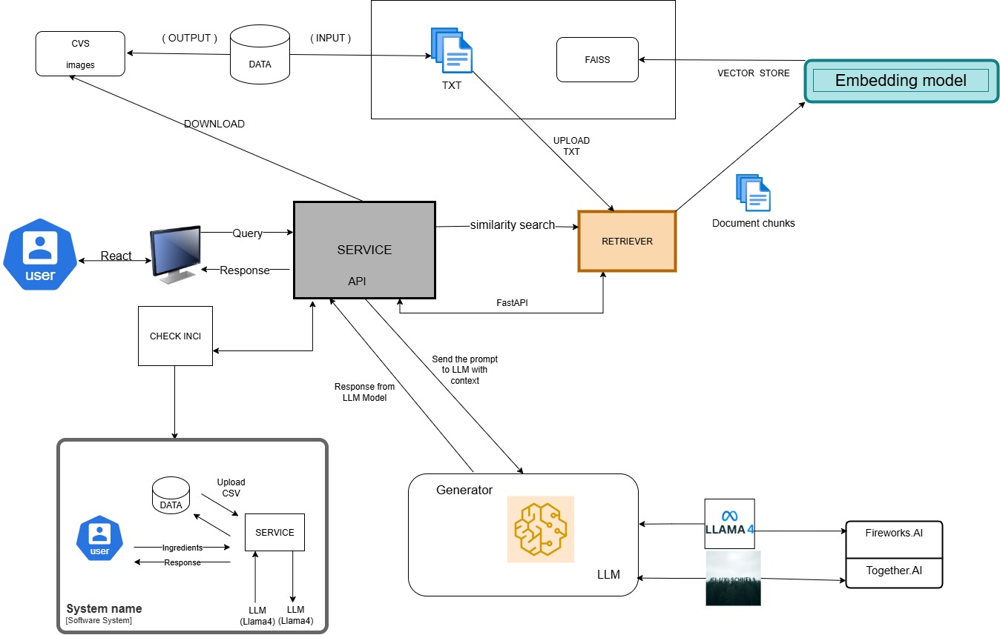

# 🧠 ETL Tweets ESG & Sustainable Cosmetics Pipeline

This project implements an **ETL (Extract, Transform, Load) pipeline enhanced with RAG (Retriever-Augmented Generation) and LLM content generation** for processing ESG, green, and sustainable cosmetics-themed tweets.  
The pipeline reads tweets and brand/INCI documents from `.txt` files, creates embeddings, and indexes them with **FAISS** to enable semantic search via a retriever microservice. This allows all functionalities to be contextually grounded in the documents provided.

It provides **four main functionalities**:

1. **Twitter Post Generation:** Generates Twitter posts using the 5 most semantically similar chunks with positive sentiment.  
2. **Instagram Post Generation:** Same as Twitter, but also generates an image for the post using **Together.ai / Flux.1-Schnell-free**.  
3. **New Product Creation:** Suggests ideas for a new product based on the input documents and tweets.  
4. **INCI Check:** Takes a list of ingredients and checks them against two CSV files (`green` and `red`) to identify sustainable or harmful ingredients. If an ingredient is not found, it is marked gray and the LLM attempts to classify it. Users can optionally add new ingredients to the green or red lists.

👉 **Note:** If desired, you can easily modify the code to replace the default **LLM** (for text and/or image generation) with a more powerful or different model, simply by updating the API calls.

This setup allows **fast, semantic-driven content generation** grounded in both ESG principles and sustainable cosmetics knowledge, while keeping the source documents as context for all tasks.

---

## 📊 Architecture Diagram



---

## 🛠️ Technologies Used

- **Python 3.11**
- **PyTorch**
- **FAISS**
- **HuggingFaceEmbeddings**
- **LangChain**
- **Fireworks API / Llama4**
- **Together.ai API / Flux.1-Schnell-free**
- **FastAPI**
- **React/Vite + TailwindCSS**
- **Node.js / npm**
- **Docker + Docker Compose**
- **Visual Studio Code**

---

## 📁 Project Structure

```bash
project/
│
├── retriever/
│   ├── main.py              
│   ├── Dockerfile
│   └── requirements.txt
│
├── api/
│   ├── main.py              
│   ├── api.py               
│   ├── inci_utils.py        
│   ├── Dockerfile
│   └── requirements.txt
│
├── frontend/
│   ├── src/
│   ├── public/
│   └── Dockerfile
│
├── data/
│   ├── faiss_index_post/
│   ├── images/
│   ├── product_images/
│   ├── tweets_ESG.txt
│   ├── tweets_green.txt
│   ├── linee_guida_brand_tone.txt
│   ├── inci_dannoso.txt
│   ├── inci_sostenibile.txt
│   ├── inci_green.csv
│   └── inci_red.csv
│
├── docker-compose.yml
├── .env.example
├── Diagram.jpeg
└── README.md
```

---

## ⚙️ Installation

### 🐳 Method 1: Using Docker (recommended)

**Prerequisites:**
- Docker
- Docker Compose

**Instructions:**

1. Clone the repository
```bash
git clone https://github.com/MChino141731/social-media-content-ai-platform.git
cd social-media-content-ai-platform
```

2. Copy the example environment file
```bash
cp .env.example .env.docker
```
Insert your personal API Keys in `.env.docker`:
```env
FIREWORKS_API_KEY_MIA=<your_fireworks_key>
TOGETHER_API_KEY=<your_together_key>
```

3. Start the containers
```bash
docker-compose up --build
```

**Notes:**
- The API will be available at [http://localhost:8000](http://localhost:8000)  
- The React/Vite frontend at [http://localhost:5173](http://localhost:5173)  
- No need to install Node.js or npm locally; everything runs in the containers.

---

### 🐍 Method 2: Without Docker (optional)

**Prerequisites:**
- Python 3.11
- pip
- Node.js / npm (only for frontend)

**Instructions:**

1. Copy the example environment file
```bash
cp .env.example .env
```
Insert your personal API Keys in `.env`.

2. Create and activate a virtual environment
```bash
python -m venv .venv
# Windows PowerShell
.\.venv\Scripts\activate.ps1
# Mac/Linux
source .venv/bin/activate
```

3. Install Python dependencies
```bash
pip install -r requirements.txt
```

4. Run the services
```bash
# Retriever
uvicorn retriever/main:app --port=9000

# API
uvicorn api/main:app --port=8000

# Frontend (optional)
cd frontend
npm install
npm run dev -- --host 0.0.0.0
```

**Notes:**
- Local `data/...` paths must exist.

---

## 🧪 How the ETL Pipeline Works

1. **Extraction:** Load tweets from `tweets_ESG.txt` and `tweets_green.txt`  
2. **Transformation:**  
   - Split texts into chunks (1 tweet = 1 chunk)  
   - Create embeddings with HuggingFace  
   - Index with FAISS  
3. **Loading and Analysis:**  
   - Semantic query via retriever  
   - Send data to Fireworks API + LLM for responses  
   - Save responses in `qa_history_prompt.csv`  

---

## 📌 Configuration Files

| File | Description |
|------|------------|
| `.env` | Local environment variables (API Key, local paths) |
| `.env.docker` | Docker environment variables (container paths, service names) |
| `docker-compose.yml` | Container and network configuration |
| `requirements.txt` | Python dependencies per microservice |

---

## 📄 License

Distributed under the **MIT License**.

---

## 👤 Authors

- @MChino141731 
- @Luisandro11
